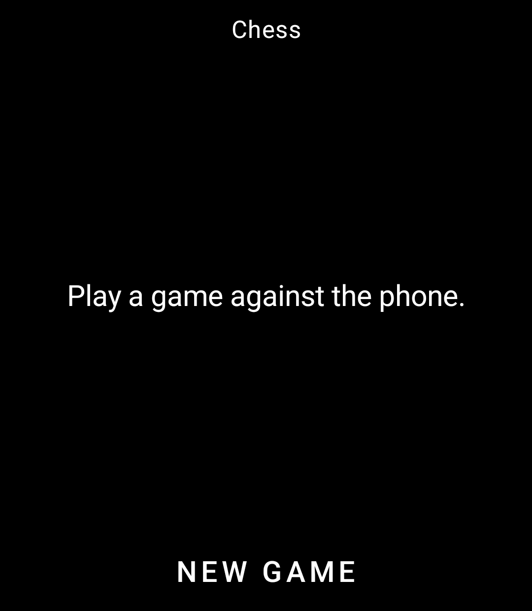
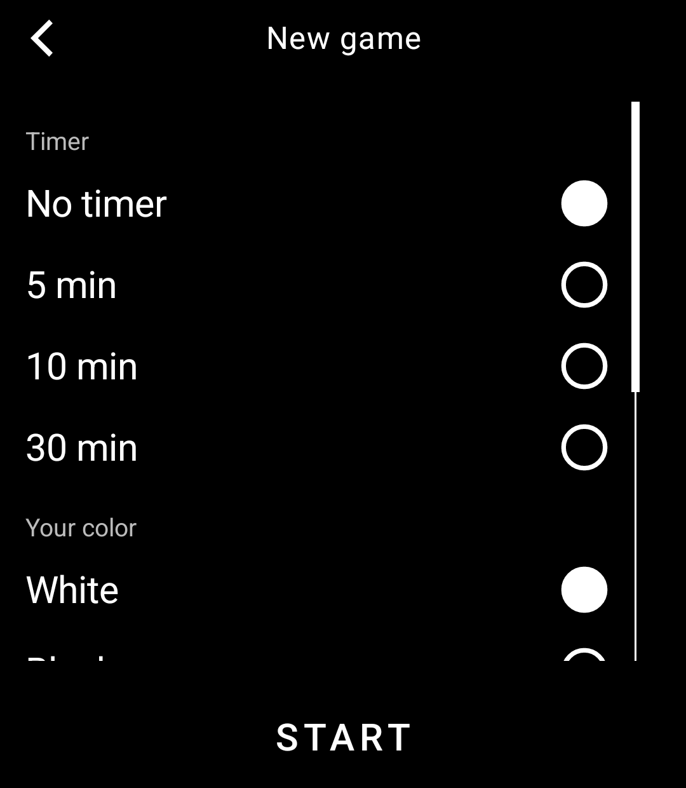
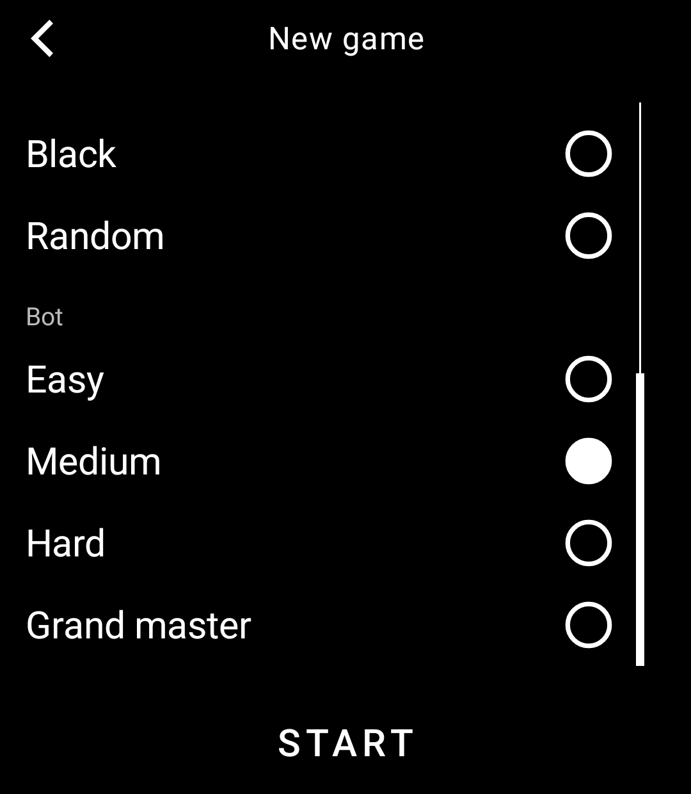
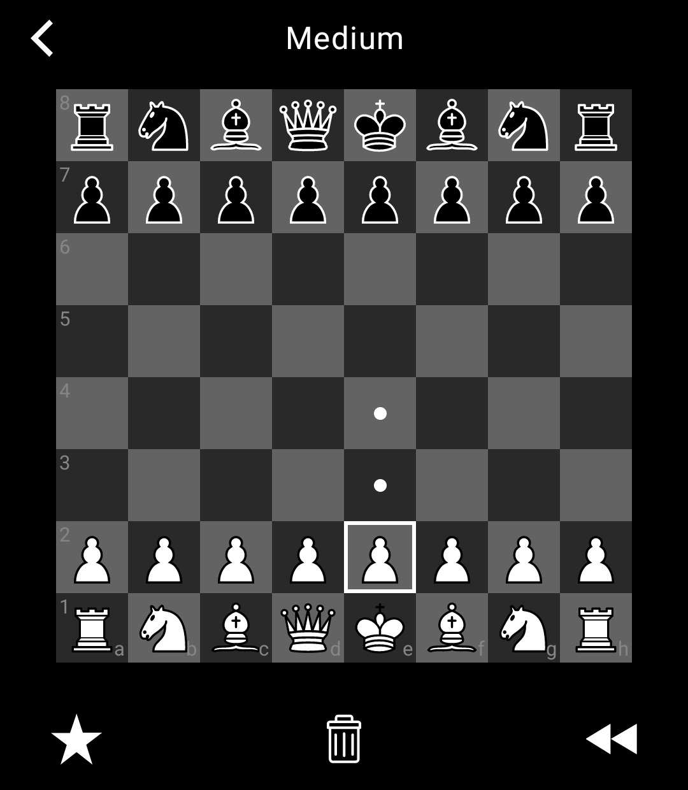
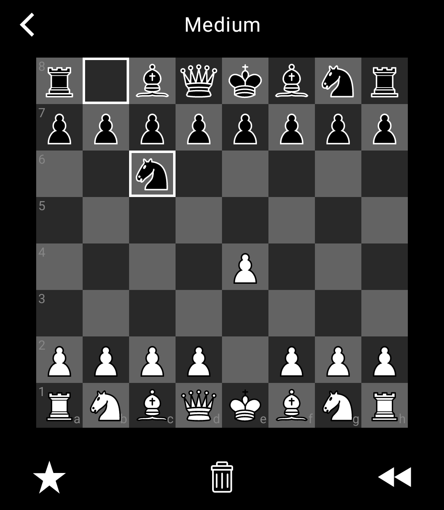

# light-chess

Chess for the [Light Phone III](https://www.thelightphone.com/). Play a game against the phone, with LightOS chrome and a grayscale board that matches the rest of the device.

This repository is a Light SDK tool. The game lives in [`tool/`](./tool); package id `com.thelightphone.chess`.

<p>
  
  
  
</p>
<p>
  
  
</p>

## What you can do

**Home.** If nothing is in progress, the home screen is just a prompt and **NEW GAME**. If a game is still going, **Continue** shows a one-line summary (your color, timer, bot) so you can pick it back up.

**New game.** Before the first move you choose:

| Setting | Options | Default |
| --- | --- | --- |
| Timer | No timer, 5 min, 10 min, 30 min | No timer |
| Your color | White, Black, Random | White |
| Bot | Easy, Medium, Hard, Grand master | Medium |

**The board.** Tap a piece, then a highlighted square. Empty targets get a dot; captures get a ring. The last move is outlined. Rank and file labels sit on the near edges, and the board flips if you are playing Black.

On a timed game the top bar is `Medium - 9:42` (bot name plus *your* remaining clock). Untimed games show only the bot name.

**During a game** the bottom bar is:

- **Star** — hint. The engine looks at the position at Hard strength and outlines a suggested from/to. Tap the destination to play it.
- **Trash** — resign, with a confirm screen.
- **Rewind** — undo your last move (and the bot’s reply). Disabled until you have moved.

Pawns that reach the last rank open a **Promote** screen (Queen, Rook, Bishop, Knight). Games end with a full-screen result: checkmate, draw, flag, or resign.

Leaving the board, pausing the app, or killing the process saves an in-progress game. Finished games are cleared.

## Bot

Search is iterative deepening with alpha-beta and Michniewski’s Simplified Evaluation Function ([Chess Programming Wiki](https://www.chessprogramming.org/Simplified_Evaluation_Function)). Easy and Medium also blunder on purpose so they are not just a shallow search.

| Level | Search | Notes |
| --- | --- | --- |
| Easy | Depth 1, ~350 ms | Often picks a random legal move; otherwise can swap the best move for a worse one |
| Medium | Depth 1, ~400 ms | Same idea, a bit more reliable |
| Hard | Depth 4, ~2 s | Full search, no forced blunders |
| Grand master | Depth 6, ~4.5 s | Same eval, longer think |

On a clock the search budget shrinks with remaining time. Hints always search at Hard, independent of the bot you are playing.

## Engine and pieces

Move generation is a 0x88 mailbox, with make/unmake, FEN, castling, en passant, promotion, threefold, fifty-move, and insufficient material. Unit tests cover start-position perft, Kiwipete, castling, and en passant.

Piece drawings are from [Wikimedia Commons SVG chess pieces](https://commons.wikimedia.org/wiki/Category:SVG_chess_pieces).

## Run it

You can sideload the APK onto a Light Phone III, or run it on an Android emulator that looks like an LP3:

- 1080 × 1240, 3.92" display
- Android API 34
- No Google Play

```bash
./gradlew :tool:installDebug
adb shell am start -n com.thelightphone.chess/com.thelightphone.sdk.LightActivity
```

For LightOS-as-a-system-app (toolbox, theme, the way a real phone launches tools), follow [Using the LightOS Emulator](docs/system_app). The tool’s `serverPackage` in [`tool/lighttool.toml`](tool/lighttool.toml) is set to `com.thelightphone.sdk.emulator` for that setup; switch it to `com.lightos` for hardware.

Open the repo in Android Studio (or IntelliJ) and run the `:tool` configuration if you prefer a GUI.

The UI is Compose on top of the SDK’s `LightScreen` / `LightViewModel` pair, using `LightTopBar`, `LightBottomBar`, `LightScrollView`, `LightText`, and `LightIcons`. Game state is a DataStore JSON blob.

## Layout

| Path | What it is |
| --- | --- |
| [`tool/src/main/kotlin/com/thelightphone/chess/`](tool/src/main/kotlin/com/thelightphone/chess/) | Screens, view models, board widget |
| [`tool/src/main/kotlin/com/thelightphone/chess/engine/`](tool/src/main/kotlin/com/thelightphone/chess/engine/) | Rules + search |
| [`sdk/`](sdk/) | Light SDK (client, UI, emulator) |
| [`docs/`](docs/) | SDK docs, including the emulator walkthrough |

This tree still includes the upstream Light SDK so the tool can build and run against it. Chess-specific code is the `tool` module.
