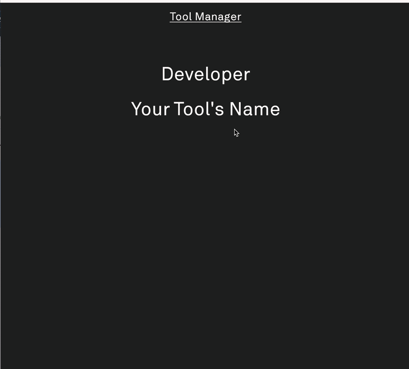

# Tool Manager Integration
The [`Tool Manager`](https://github.com/lightphone/light-tool-manager) allows Light Phone users to transfer data to and from their device locally using a browser-based interface. 
Tools built with the SDK can easily declare themselves to be "Tool Manager Capable", and provide a structured way to serve or receive content directly from their private file directories. 
These tools can also provide actions to run when their data is updated in the background.

Some example use cases:
* You're making a music tool, and you want to provide a way for users to upload their library from their computer.
* You're making a contacts tool, and you want to provide a way for users to upload a .vcf file.
* You're making a photo/video gallery tool, and you want to provide a way for users to select files and export them to their computer.

As an example, we've written a dead simple [File Browser demo](../../examples/tool-manager-demo). The tool itself just lists the files that you upload.

## Hooking up your tool

1. First, declare `tool-manager-provider` in your lighttool.toml's capabilities:
   ```toml
   capabilities = ["tool-manager-provider"]
   ```
   This tells the build plugin to add the meta-data to your tool's `AndroidManifest.xml` that allows the Tool Manager server (LightOS) to automatically discover it.
2. You'll need to provide a `ClientToolManifest` that describes what you'd like the directory structure and Tool Manager UX to look like for your tool. 
   If you don't already have one, you'll need to create an `@EntryPoint` object, which is invoked when your Tool first boots. 
   Inside it, override the `getToolManagerManifest()` method:
```kotlin
@EntryPoint
object ToolEntryPoint : LightEntryPoint {
    override fun getToolManagerManifest(): ClientToolManifest {
        return ClientToolManifest(
            title = "Your Tool's Name",
            roots = listOf(
                ClientLeafNode(
                    FileBrowserSpec(
                        label = "Your Files Here", 
                        path = "user_files", 
                        headerText = "An optional description of what the user might do..."
                    )
                )
            )
        )
    }   
    // ...
}
```
When the user first opens the client-side Tool Manager UI in their browser, They'll see what you provide for `title` listed amongst all the other Tool Manager-capable tools they have installed.
When they click into it, they'll see the structure you've defined with `roots`. In the example above, they'll see a listing titled "Your Files Here". When they click that, they'll be taken to a `File Browser` screen (as defined by the Tool Manager's [FileBrowserSpec UI template](https://github.com/lightphone/light-tool-manager/tree/main/composeApp#templates)).
Things to keep in mind:
* You are free to provide multiple `Client*Node`s in the `roots` list. They'll show up in order when the user clicks into your tool.
* A directory will be created in your tool's `files/shared` directory for each spec's `path` the first time your tool's data is remotely accessed. You are free to create and fill these directories beforehand.
* If you want nest multiple directory layers, you can use `ClientBranchNode` instead of `ClientLeafNode`.
* Be sure to check out the [other available templates](https://github.com/lightphone/light-tool-manager/tree/main/composeApp#templates) - you don't need to use `FileBrowserSpec` if you just want to provide a simple upload/download flow.



3. (Optional) You can define an action to be run in the background whenever a user changes any files within your tool. This is done via another override in your `@EntryPoint`:
```kotlin
@EntryPoint
object ToolEntryPoint : LightEntryPoint {
    // ...
    override suspend fun onToolManagerDataUpdate() {
        super.onToolManagerDataUpdate()
        // DO SOMETHING HERE
    }
}
```
`onToolManagerDataUpdate()` is invoked from a `WorkManager` worker, so you're free to perform longer-running operations. The limit is ~10 minutes, but we kinda hope you're not using all of that.
We recommend launching your own worker using the `LightWork` APIs here for better bookkeeping.